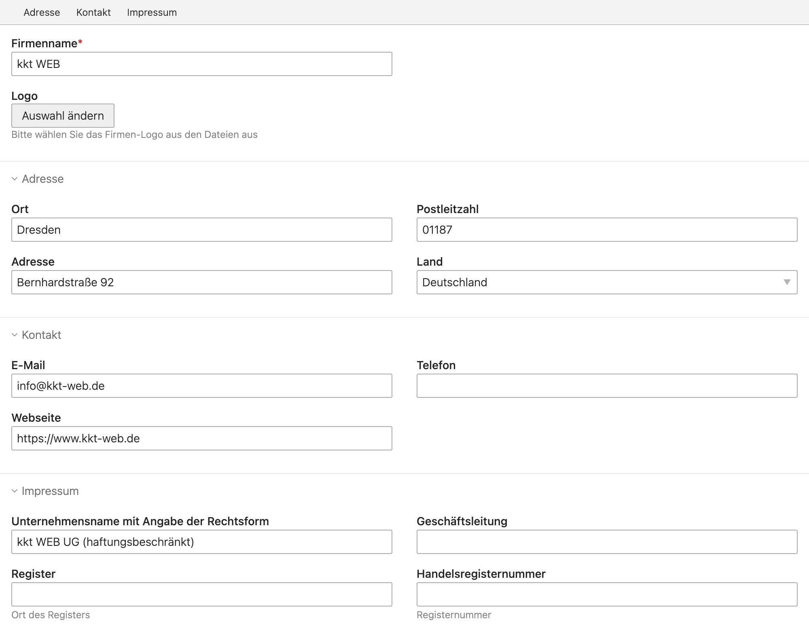

# biankakriege/contao-company-data

`biankakriege/contao-company-data` is an extension for the [Contao CMS][Contao].

With this extension you are able to manage one or more company data and add content elements or modules to show contact data for e.g. the imprint or the logo and change these data at one place. You can also add persons to a company and show them as list or single elements on your page.   

## Installation

### Install using Contao Manager

Search for **biankakriege/contao-company-data** and you will find this extension.

### Install using Composer

```bash
composer require biankakriege/contao-company-data
```

### Backend

