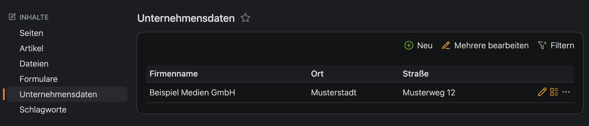
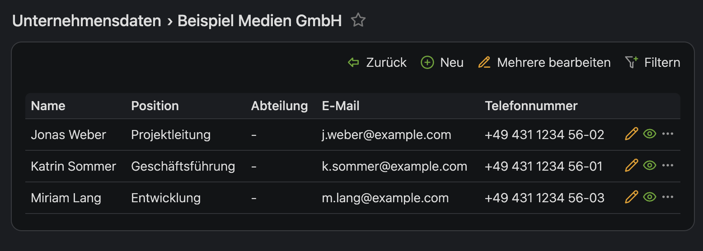
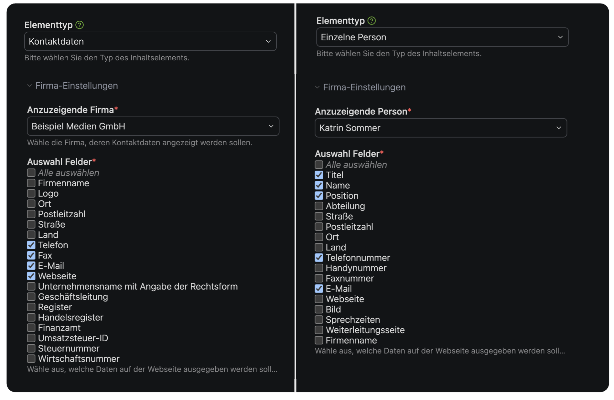
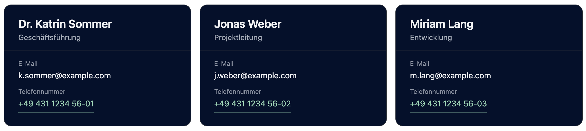

# biankakriege/contao-company-data

**English** | [Deutsch](README.de.md)

`biankakriege/contao-company-data` is an extension for the [Contao CMS][Contao].

Manage company data and contact persons in one place and reuse them in content elements, modules, form notifications and as structured data (schema.org JSON-LD). Change it once, and every page shows the update.

## Installation

Search for **biankakriege/contao-company-data** in the Contao Manager or install it via Composer:

```bash
composer require biankakriege/contao-company-data
```

## Usage

### Companies and persons

Create companies under **Content › Company data**: address, contact details, legal notice and logo. Each company can have persons with position, contact details, office hours and image.





### Content elements and modules

- **Contact details:** contact details of a company, e.g. for the imprint or footer
- **Person list** / **Single person:** contact persons of a company
- **Logo** and **Company contact details** as frontend modules, e.g. for the page layout

Use **Field selection** to choose which data each element shows.






### Forms

In the form settings (**Enrich form data with company**) you can append an email signature or provide placeholders such as `##form_company_name##` for the Notification Center.

### Structured data (JSON-LD)

Select a company in the website root (**Company (JSON-LD)**) to output it as `Organization` on every page. The content elements add the company and the shown persons as well. Schema.org type, description and profiles (`sameAs`) are set per company.


Check the result with the [Schema Markup Validator](https://validator.schema.org/).

## Templates

All templates can be overridden as usual, e.g. `bk_company_contact.html.twig`, `content-person-list.html.twig` or `mail_signature.html.twig`.

## License

LGPL-3.0-or-later

[Contao]: https://contao.org